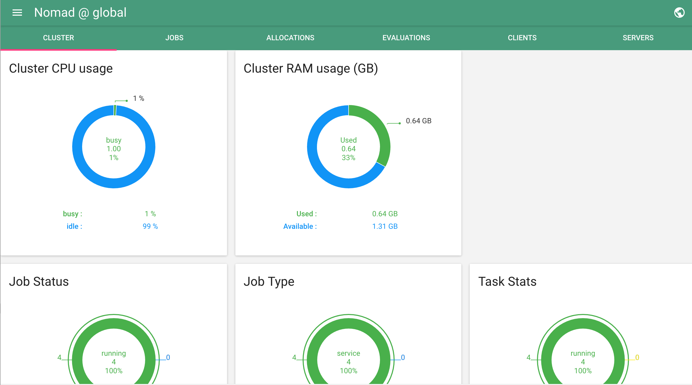
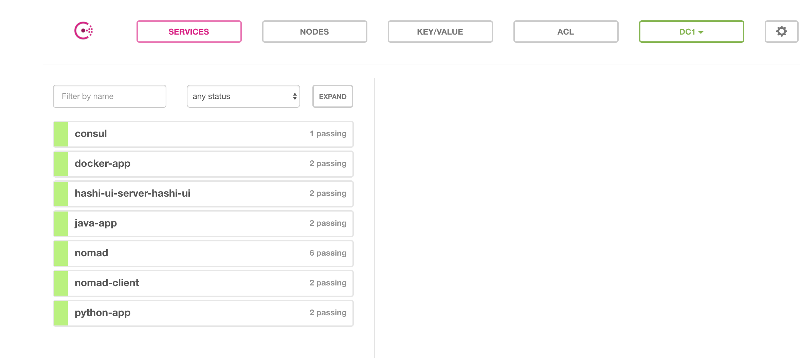

# nomad-consul-demo

Vagrant box with pre-provisioned [consul](https://www.consul.io/ "Consul Homepage") and [nomad](https://www.nomadproject.io/ "Nomad Homepage").

Necessary docker and java drivers which are used for the Nomad jobs are also pre-installed. 

## Prerequisites:
- VirtualBox >= 5.1.18
- Vagrant >= 1.9.1

### Setup:
```
# cd to project root directory
cd nomad-consul-demo
vagrant up
```

### SSH into a virtual machine
```
vagrant ssh
```

## Project structure

Currently the demo vagrant box contains these directories:

- ```ansible```, this directory contains the ansbile roles which are used for the pre-provisioning of the VM 
- ```apps```, contains the demo applications. Java and Python hello world apps 
- ```jobs```, contains the python, java and docker nomad job definitions. Additionally the [hashi-ui](https://github.com/jippi/hashi-ui) job is defined for setup of the nomad-ui. 
The jobs definitions are written in the [hcl](https://github.com/hashicorp/hcl) language.

## Nomad and Consul UI-s 

### Nomad-UI

[http://10.100.194.200:3000/](http://10.100.194.200:3000/)



### Consul-UI

[http://10.100.194.200:8500/ui](http://10.100.194.200:8500/ui)


